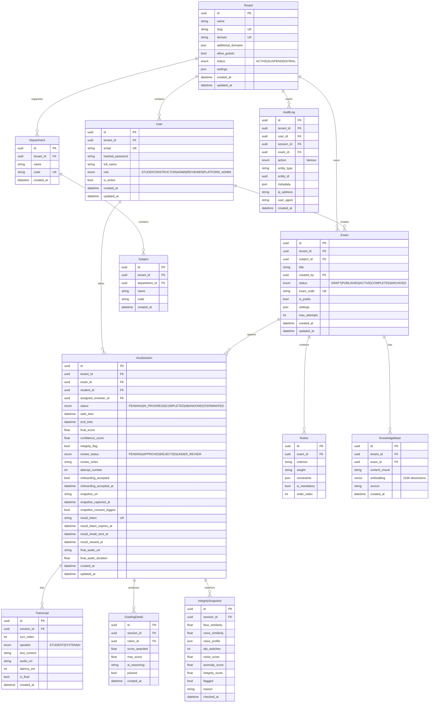

# Intelligent Viva — Database Models Reference

**Version:** 3.0  
**Last Updated:** February 1, 2026

---

## 📊 Entity Relationship Diagram

---

## 📋 Model Details

### 1. Tenant (v3.0)

| Column | Type | Constraints | Description |
|--------|------|-------------|-------------|
| `id` | UUID | PK, Default: uuid4 | Unique identifier |
| `name` | String | NOT NULL | Organization display name |
| `slug` | String | UNIQUE, NOT NULL | URL-safe identifier |
| `domain` | String | UNIQUE, NULLABLE | Custom domain (optional) |
| `logo_url` | String | NULLABLE | Organization logo URL |
| `primary_color` | String | NULLABLE | Brand color hex code |
| `additional_domains` | JSONB (List) | NULLABLE | Alternative domains |
| `allow_guests` | Boolean | NOT NULL, Default: FALSE | Allow public exam access |
| `status` | Enum | NOT NULL, Default: TRIAL | ACTIVE, SUSPENDED, TRIAL |
| `subscription_tier` | String | NOT NULL, Default: "free" | free, pro, enterprise |
| `max_students` | Integer | NULLABLE | Student seat quota |
| `max_exams_per_month` | Integer | NULLABLE | Monthly exam quota |
| `settings` | JSONB | NOT NULL, Default: {} | Features, branding, configs |
| `data_residency` | String | NULLABLE | Data storage region |
| `gdpr_enabled` | Boolean | Default: FALSE | GDPR compliance mode |
| `created_at` | DateTime | NOT NULL, Auto | Creation timestamp |
| `updated_at` | DateTime | NOT NULL, Auto | Last update timestamp |
| `deactivated_at` | DateTime | NULLABLE | When tenant was suspended |

**Relationships:**
- `users` → User (one-to-many)
- `exams` → Exam (one-to-many)
- `departments` → Department (one-to-many)
- `audit_logs` → AuditLog (one-to-many)

---

### 2. User

| Column | Type | Constraints | Description |
|--------|------|-------------|-------------|
| `id` | UUID | PK, Default: uuid4 | Unique identifier |
| `tenant_id` | UUID | FK(tenants.id), NOT NULL | Parent tenant |
| `email` | String | UNIQUE, NOT NULL | User email address |
| `hashed_password` | String | NOT NULL | Bcrypt hashed password |
| `full_name` | String | NOT NULL | Display name |
| `role` | Enum | NOT NULL, Default: STUDENT | STUDENT, INSTRUCTOR, ADMIN, REVIEWER, PLATFORM_ADMIN |
| `is_active` | Boolean | NOT NULL, Default: TRUE | Account status |
| `created_at` | DateTime | NOT NULL, Auto | Creation timestamp |
| `updated_at` | DateTime | NOT NULL, Auto | Last update timestamp |

**Indexes:**
- `ix_users_tenant_id` on `tenant_id`
- `ix_users_email` on `email`

---

### 3. Department (NEW - v3.0)

| Column | Type | Constraints | Description |
|--------|------|-------------|-------------|
| `id` | UUID | PK, Default: uuid4 | Unique identifier |
| `tenant_id` | UUID | FK(tenants.id), NOT NULL | Parent tenant |
| `name` | String | NOT NULL | Department name |
| `code` | String | UNIQUE within tenant | Short code |
| `description` | String | NULLABLE | Department description |
| `head_user_id` | UUID | FK(users.id), NULLABLE | Head of Department |
| `is_active` | Boolean | Default: TRUE | Active status |
| `created_at` | DateTime | NOT NULL, Auto | Creation timestamp |
| `updated_at` | DateTime | NOT NULL, Auto | Last update timestamp |

---

### 4. Subject (NEW - v3.0)

| Column | Type | Constraints | Description |
|--------|------|-------------|-------------|
| `id` | UUID | PK, Default: uuid4 | Unique identifier |
| `tenant_id` | UUID | FK(tenants.id), NOT NULL | Parent tenant |
| `department_id` | UUID | FK(departments.id) | Parent department |
| `name` | String | NOT NULL | Subject name |
| `code` | String | NOT NULL | Short code |
| `description` | String | NULLABLE | Course description |
| `credits` | Integer | NULLABLE | Course credits |
| `is_active` | Boolean | Default: TRUE | Active status |
| `created_at` | DateTime | NOT NULL, Auto | Creation timestamp |
| `updated_at` | DateTime | NOT NULL, Auto | Last update timestamp |

---

### 5. Exam

| Column | Type | Constraints | Description |
|--------|------|-------------|-------------|
| `id` | UUID | PK, Default: uuid4 | Unique identifier |
| `tenant_id` | UUID | FK(tenants.id), NOT NULL | Parent tenant |
| `subject_id` | UUID | FK(subjects.id), NULLABLE | Associated subject |
| `title` | String | NOT NULL | Exam title |
| `created_by` | UUID | FK(users.id), NOT NULL | Creator instructor |
| `status` | Enum | NOT NULL, Default: DRAFT | DRAFT, PUBLISHED, ACTIVE, COMPLETED, ARCHIVED |
| `exam_code` | String | UNIQUE, NOT NULL, INDEXED | 8-char access code |
| `is_public` | Boolean | NOT NULL, Default: FALSE | Guest access enabled |
| `settings` | JSONB | NULLABLE | Exam configuration |
| `max_attempts` | Integer | NOT NULL, Default: 1 | Maximum attempts per student |
| `created_at` | DateTime | NOT NULL, Auto | Creation timestamp |
| `updated_at` | DateTime | NOT NULL, Auto | Last update timestamp |

**Indexes:**
- `ix_exams_tenant_id` on `tenant_id`
- `ix_exams_exam_code` on `exam_code`

---

### 6. VivaSession

| Column | Type | Constraints | Description |
|--------|------|-------------|-------------|
| `id` | UUID | PK, Default: uuid4 | Unique identifier |
| `tenant_id` | UUID | FK(tenants.id), NOT NULL | Parent tenant |
| `exam_id` | UUID | FK(exams.id), NOT NULL | Associated exam |
| `student_id` | UUID | FK(users.id), NOT NULL | Student taking exam |
| `assigned_reviewer_id` | UUID | FK(users.id), NULLABLE | Assigned reviewer |
| `status` | Enum | NOT NULL, Default: PENDING | Session status |
| `review_status` | Enum | NOT NULL, Default: PENDING | PENDING, APPROVED, REJECTED, UNDER_REVIEW |
| `review_notes` | String | NULLABLE | Review comments |

**New v3.0 Columns:**

| Column | Type | Constraints | Description |
|--------|------|-------------|-------------|
| `assigned_reviewer_id` | UUID | FK(users.id), NULLABLE | Reviewer assignment |
| `review_notes` | String | NULLABLE | Review feedback |

**Indexes:**
- `ix_sessions_tenant_id` on `tenant_id`
- `ix_sessions_result_token` on `result_token`
- `ix_sessions_review_status` on `review_status`

---

### 7. KnowledgeBase (RAG)

| Column | Type | Constraints | Description |
|--------|------|-------------|-------------|
| `id` | UUID | PK, Default: uuid4 | Unique identifier |
| `tenant_id` | UUID | FK(tenants.id), NOT NULL | Parent tenant |
| `exam_id` | UUID | FK(exams.id), NOT NULL | Associated exam |
| `content_chunk` | String | NOT NULL | Text chunk (~500 tokens) |
| `embedding` | Vector(1536) | NULLABLE | pgvector embedding |
| `source` | String | NOT NULL | Source document name |
| `created_at` | DateTime | NOT NULL, Auto | Creation timestamp |

**Indexes:**
- `ix_knowledge_base_tenant_id` on `tenant_id`
- HNSW index on `embedding` for vector similarity search

---

### 8. AuditLog

| Column | Type | Constraints | Description |
|--------|------|-------------|-------------|
| `id` | UUID | PK, Default: uuid4 | Unique identifier |
| `tenant_id` | UUID | FK(tenants.id), NOT NULL | Parent tenant |
| `user_id` | UUID | FK(users.id), NULLABLE | Actor |
| `session_id` | UUID | FK(sessions.id), NULLABLE | Related session |
| `exam_id` | UUID | FK(exams.id), NULLABLE | Related exam |
| `action` | Column | NOT NULL | Action type |
| `entity_type` | String | NULLABLE | Affected entity type |
| `entity_id` | UUID | NULLABLE | Affected entity ID |
| `log_metadata` | JSONB | NULLABLE | Before/after diffs |
| `ip_address` | String | NULLABLE | Client IP |
| `user_agent` | String | NULLABLE | Client browser |
| `created_at` | DateTime | NOT NULL, Auto | When logged |

**Indexes:**
- `ix_audit_logs_tenant_id` on `tenant_id`
- `ix_audit_logs_created_at` on `created_at`
- `ix_audit_logs_user_id` on `user_id`

---

### 9. OrganizationRequest (NEW - v3.0)

| Column | Type | Constraints | Description |
|--------|------|-------------|-------------|
| `id` | UUID | PK, Default: uuid4 | Unique identifier |
| `name` | String | NOT NULL | Organization name |
| `email` | String | INDEXED, NOT NULL | Contact email |
| `slug` | String | NOT NULL | Proposed slug |
| `full_name` | String | NOT NULL | Contact person name |
| `phone` | String | NULLABLE | Contact phone |
| `use_case` | String | NULLABLE | Intended use case |
| `status` | Enum | NOT NULL, Default: PENDING | PENDING, APPROVED, REJECTED |
| `admin_notes` | String | NULLABLE | Internal notes |
| `created_at` | DateTime | NOT NULL, Auto | Creation timestamp |
| `updated_at` | DateTime | NOT NULL, Auto | Last update timestamp |

---

## 🔧 Indexes Summary

| Table | Column(s) | Type | Purpose |
|-------|-----------|------|---------|
| `tenants` | `slug` | UNIQUE | Fast tenant lookup |
| `tenants` | `domain` | UNIQUE | Domain-based routing |
| `users` | `tenant_id` | BTREE | Tenant scoping |
| `exams` | `tenant_id` | BTREE | Tenant scoping |
| `exams` | `exam_code` | UNIQUE | Fast code lookup |
| `exams` | `is_public` | BTREE | Public exam filtering |
| `sessions` | `tenant_id` | BTREE | Tenant scoping |
| `sessions` | `result_token` | UNIQUE | Fast token verification |
| `sessions` | `review_status` | BTREE | Reviewer queue |
| `knowledge_base` | `tenant_id` | BTREE | Tenant scoping |
| `knowledge_base` | `embedding` | HNSW | Vector similarity search |
| `audit_logs` | `tenant_id` | BTREE | Tenant scoping |
| `audit_logs` | `created_at` | BTREE | Time-range queries |

---

## 🔒 Constraints & Business Rules

| Constraint | Description |
|------------|-------------|
| `sessions.tenant_id` must match `exam.tenant_id` | Cross-tenant session creation blocked |
| `users.tenant_id` validated via JWT | Token tampering prevented |
| Grade finalization lock | No changes after APPROVED/REJECTED |
| Rubric edit lock | No changes when active sessions exist |
| Tenant status check | Suspended tenants blocked at API level |

---

## 📦 Audit Actions (v3.0)

- `user.login`, `user.logout`, `user.create`, `user.update`, `user.delete`
- `tenant.create`, `tenant.update`, `tenant.settings.update`
- `exam.create`, `exam.update`, `exam.delete`, `exam.publish`
- `session.join`, `session.start`, `session.end`, `session.terminate`
- `admin.action`, `reviewer.assign`

---

### 10. Payment (NEW - v3.0)

| Column | Type | Constraints | Description |
|--------|------|-------------|-------------|
| `id` | UUID | PK, Default: uuid4 | Unique identifier |
| `tenant_id` | UUID | FK(tenants.id), NOT NULL | Parent tenant |
| `order_id` | String | INDEXED, NOT NULL | Razorpay Order ID |
| `payment_id` | String | INDEXED, NULLABLE | Razorpay Payment ID |
| `signature` | String | NULLABLE | Cryptographic signature |
| `amount` | Integer | NOT NULL | Amount in paise |
| `currency` | String | Default: "INR" | Currency code |
| `status` | Enum | Default: CREATED | CREATED, CAPTURED, FAILED |
| `receipt` | String | NULLABLE | Receipt ID |
| `notes` | JSONB | Default: {} | Additional metadata |
| `created_at` | DateTime | NOT NULL, Auto | Creation timestamp |
| `updated_at` | DateTime | NOT NULL, Auto | Last update timestamp |

**Indexes:**
- `ix_payments_order_id` on `order_id`
- `ix_payments_payment_id` on `payment_id`
