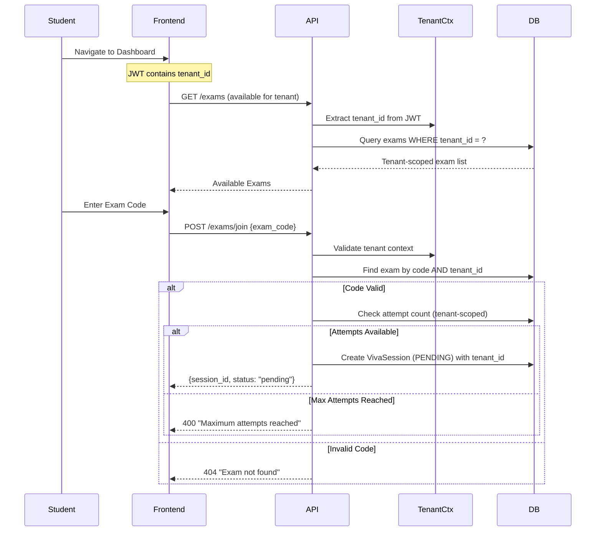
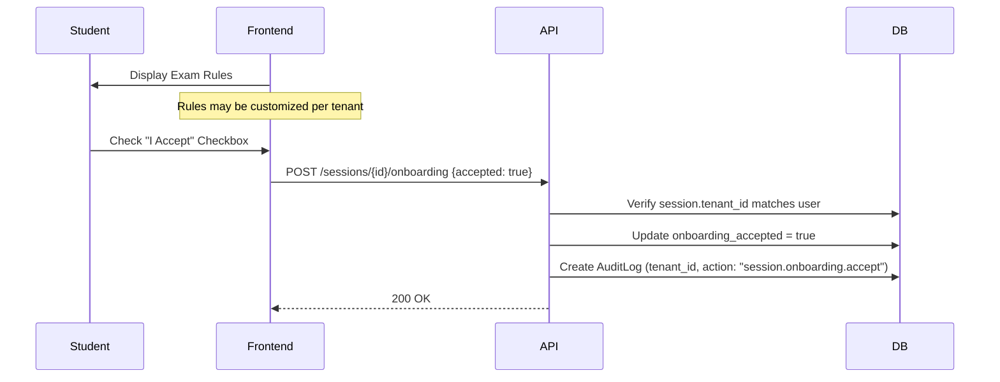
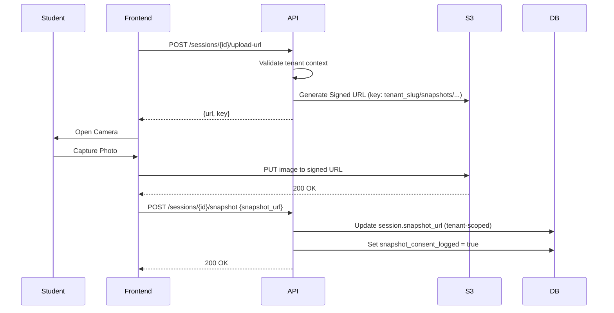
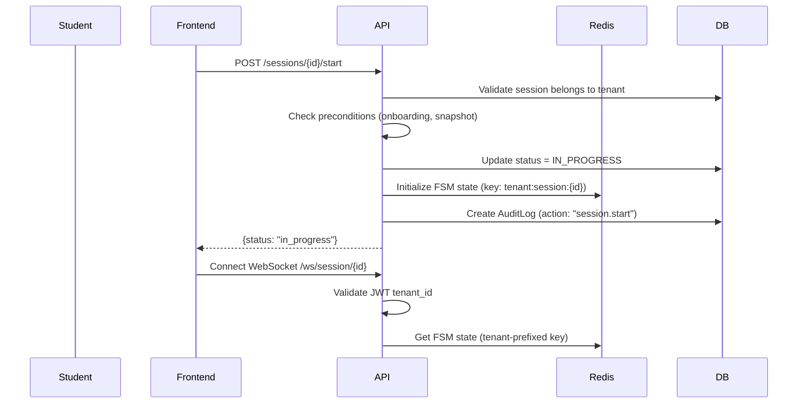
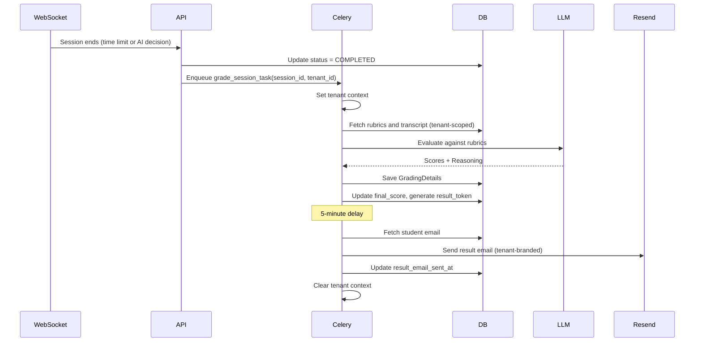
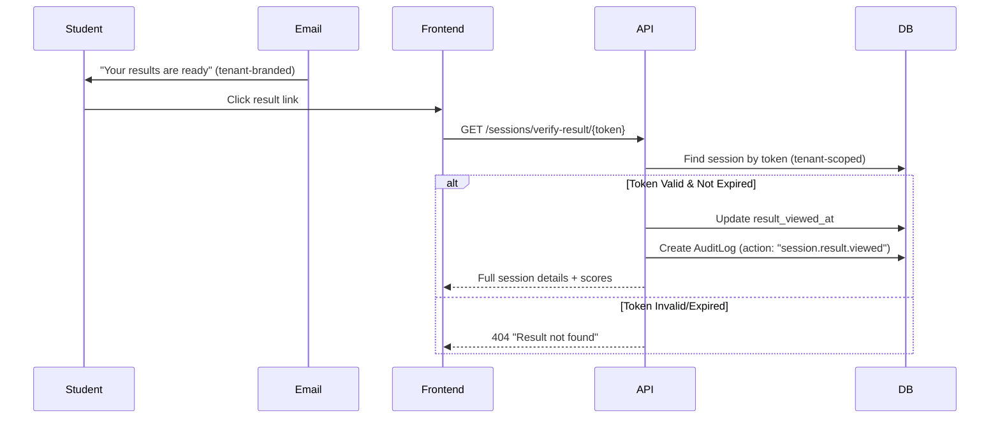
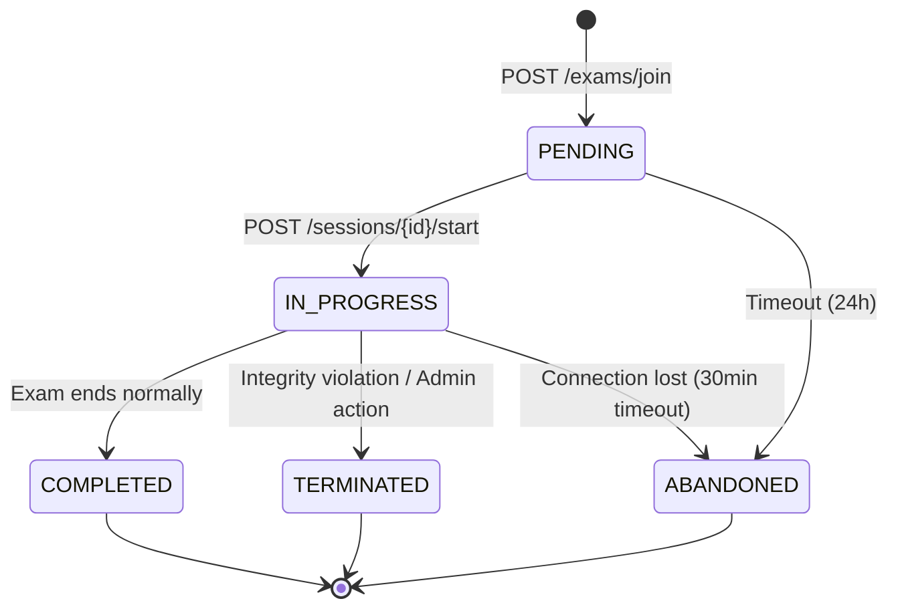
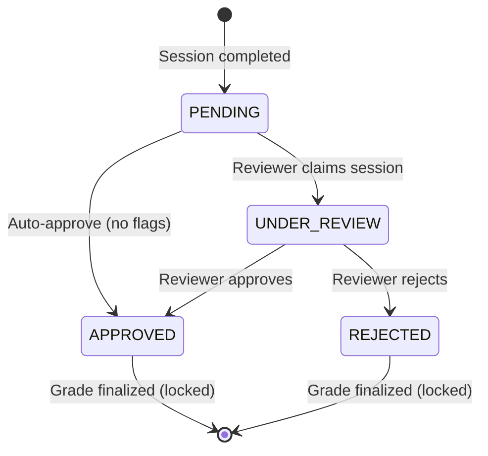

# Scira - Exam Flow Documentation

**Version:** 3.0  
**Last Updated:** February 1, 2026

---

## 1. Overview

This document describes the complete end-to-end user flow for taking an AI-proctored viva examination in the **multi-tenant** Scira system. All operations are scoped to the user's `tenant_id`, ensuring complete isolation between organizations.

---

## 2. Phase 1: Join Exam (Tenant-Scoped)

Students discover and join exams using an **Exam Access Code** within their tenant context.



### Key Multi-Tenant Behaviors:
- **Exam codes are tenant-scoped**: Same code can exist in different tenants
- **Attempt counting**: Per student, per exam, within tenant
- **Session creation**: Inherits `tenant_id` from authenticated user

### Phase 1.1: Public Guest Access (New v3.0)
External users can join **Public Exams** (`is_public=True`) without prior registration.
1.  User enters Exam Code on landing page.
2.  API identifies target Tenant via Exam Code.
3.  User is redirected to SSO with `target_tenant={slug}`.
4.  After login, user is provisioned as a temporary guest in that Tenant.
5.  Exam starts immediately.

---

## 3. Phase 2: Pre-Exam Onboarding

### 3.1 Terms & Conditions Acceptance



### 3.2 Identity Snapshot Capture



### Key Multi-Tenant Behaviors:
- **S3 Key Prefixing**: All files stored under `tenant_slug/snapshots/`
- **Consent Logging**: GDPR compliance tracked per tenant
- **Audit Trail**: All actions logged with `tenant_id`

---

## 4. Phase 3: Start Viva Session



### Redis Key Pattern (Multi-Tenant):
```
tenant:{tenant_id}:session:{session_id}:state
tenant:{tenant_id}:session:{session_id}:history
tenant:{tenant_id}:session:{session_id}:voice_profile
```

---

## 5. Phase 4: The Viva Loop

The real-time oral examination with AI-powered questioning.

```mermaid
sequenceDiagram
    participant Student
    participant WebSocket
    participant FSM
    participant Deepgram
    participant LLM
    participant ElevenLabs
    participant KnowledgeBase

    loop Viva Conversation
        Student->>WebSocket: Stream Audio (Binary)
        WebSocket->>Deepgram: Forward Audio
        Deepgram-->>WebSocket: Transcript

        FSM->>FSM: Transition to EVALUATION
        WebSocket->>KnowledgeBase: Query context (tenant_id filter)
        KnowledgeBase-->>WebSocket: Relevant chunks
        WebSocket->>LLM: Generate Response
        LLM-->>WebSocket: AI Text

        FSM->>FSM: Transition to TRANSFER
        WebSocket->>ElevenLabs: Text-to-Speech
        ElevenLabs-->>WebSocket: Audio Stream
        WebSocket->>Student: Play Audio + Transcript
        FSM->>FSM: Transition to QUESTION
    end

### AI Behavior Configuration (v3.0)
The AI Examiner adapts based on Exam Settings:
*   **Difficulty**:
    *   *Easy*: Focus on basic definitions, encouraging tone.
    *   *Medium*: Application-based questions, professional tone.
    *   *Hard*: Complex scenarios, critical/strict tone.
*   **Question Limit**:
    *   AI tracks `questions_asked` count vs `number_of_questions` (default: 5).
    *   Automatically transitions to END state when limit reached.
```

### Multi-Tenant RAG Query:
```sql
SELECT content_chunk, embedding <=> query_embedding AS distance
FROM knowledge_base
WHERE exam_id = ? AND tenant_id = ?
ORDER BY distance
LIMIT 5;
```

---

## 6. FSM State Timeouts & Auto-Progression

### 6.1 Overview
The Dialogue State Machine (FSM) implements deterministic timeout controls to ensure exam sessions progress even when students are unresponsive or technical issues occur. This prevents sessions from indefinitely stalling and ensures fair time management.

### 6.2 Timeout Specifications

| State | Timeout Duration | Trigger Condition | Auto-Transition Behavior |
|-------|-----------------|-------------------|-------------------------|
| **CALIBRATION** | **45 seconds** | No voice input detected | → QUESTION (Generate first question) |
| **QUESTION** | **90 seconds** | No response started | → EVALUATION → TRANSFER → QUESTION |
| **LISTENING** | **90 seconds** | Silence during answer | → EVALUATION (Mark as "No Response") |

### 6.3 Implementation Details

#### Calibration Timeout (45s)
```python
# backend/app/services/dialogue/state_agent.py
CALIBRATION_LIMIT = 45  # seconds

if current_state == DialogueState.CALIBRATION:
    if elapsed > CALIBRATION_LIMIT:
        # Force transition: CALIBRATION → QUESTION
        response_text = "I didn't hear you, but let's begin. " + first_question
        fsm.transition_to(DialogueState.QUESTION, force=True)
```

**Purpose**: Prevents students from being stuck in calibration phase indefinitely if:
- Microphone permissions denied
- Hardware malfunction
- Network latency preventing voice detection

**UX**: Frontend displays 45-second countdown (`CountDown45` component) synchronized with backend timeout.

#### Question Timeout (90s)
```python
# backend/app/services/dialogue/state_agent.py
QUESTION_LIMIT = 90  # seconds

if current_state in [DialogueState.QUESTION, DialogueState.LISTENING]:
    if elapsed > QUESTION_LIMIT:
        # Mark as no response and proceed to next question
        evaluation = {"is_satisfactory": False, "reason": "No response (Timeout)"}
        fsm.transition_to(DialogueState.TRANSFER, force=True)
        response_text = "Let's move on to the next question. " + next_question
```

**Purpose**: Ensures exam progresses even if student:
- Doesn't respond within reasonable time
- Connection drops during answer
- Experiences audio output issues

### 6.4 Timeout Monitoring & Heartbeat

**Heartbeat Interval**: 10 seconds  
**Monitoring Location**: `backend/app/api/v1/websocket.py` (WebSocket heartbeat loop)

```python
# Executed every 10 seconds
timeout_response = await state_agent.handle_timeout()
if timeout_response:
    # Broadcast state update to frontend
    # Generate and speak timeout message
    # Persist transition to Redis
```

**Activity Timestamp Tracking**:
- `last_activity_at`: Updated **only** on student speech input (NOT on state transitions)
- Elapsed time calculated: `(current_time - last_activity_at).total_seconds()`

### 6.5 Frontend Synchronization

| Component | Timer Display | Purpose |
|-----------|--------------|----------|
| `CalibrationPhase.tsx` | 45s countdown | Visual feedback during mic check |
| `VivaOrchestrator.tsx` | Question timer (60s display) | Per-question time pressure indicator |

**Note**: Frontend timers are for UX feedback only. **Backend timeouts are authoritative** for state transitions.

### 6.6 Edge Case Handling

| Scenario | Behavior |
|----------|----------|
| Student speaks at 44s in calibration | Timer resets; calibration continues |
| WebSocket reconnect during timeout | Activity timestamp preserved in Redis |
| Multiple rapid timeouts | Each creates audit log entry; exam continues |
| Manual session end during timeout | Timeout handling aborted; normal end flow |

---

## 7. Phase 5: Session Completion & Grading



---

## 8. Phase 6: Result Notification & Viewing



---

## 9. Session Status State Machine



---

## 10. Review Status Flow



### Grade Finalization Lock
Once a session reaches `APPROVED` or `REJECTED` status:
- Scores become immutable
- No further review actions allowed
- Audit log captures final state

---

## 11. Multi-Tenant Summary

| Aspect | Implementation |
|--------|----------------|
| **Exam Discovery** | Filtered by `tenant_id` from JWT |
| **Session Creation** | Inherits `tenant_id` from user |
| **S3 Storage** | Prefixed with `tenant_slug` |
| **Redis State** | Keys prefixed with `tenant:{tenant_id}:` |
| **RAG Queries** | Filtered by `tenant_id` |
| **Email Templates** | Tenant-branded via settings |
| **Audit Logging** | All entries include `tenant_id` |
| **Celery Tasks** | Tenant context passed and restored |
