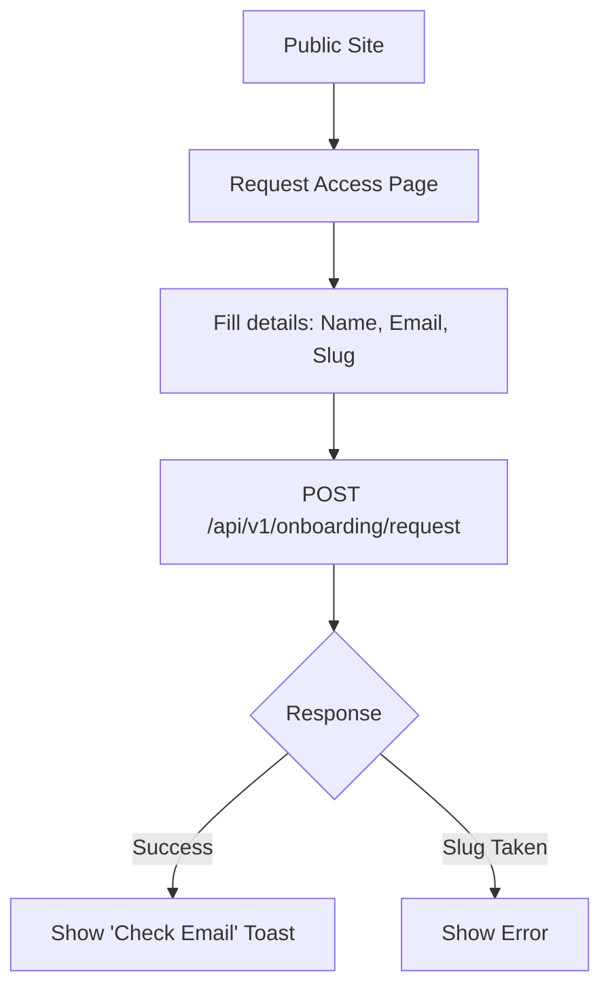
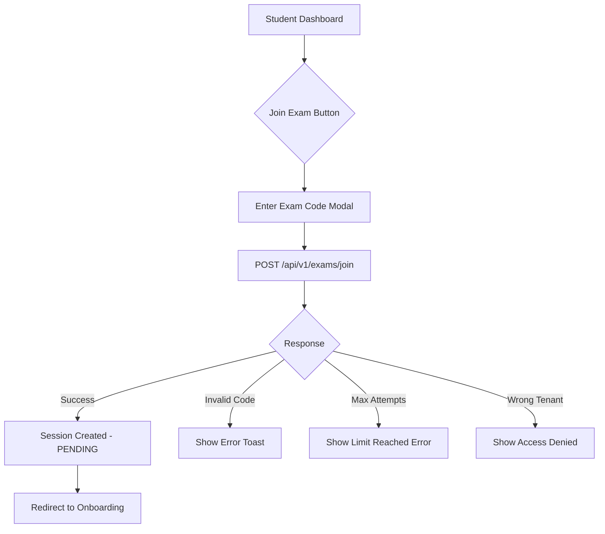

# Intelligent Viva - Frontend Integration Workflow

**Version:** 3.0  
**Last Updated:** February 1, 2026

---

## 1. Authentication Flow (Multi-Tenant)

The system uses JWT-based authentication with embedded tenant claims.

### **Login**
- **Endpoint**: `POST /api/v1/auth/login`
- **Body**: `{"email": "...", "password": "..."}`
- **Response**: Returns `access_token` with tenant claims.
- **Token Payload**:
  ```json
  {
    "sub": "user-uuid",
    "email": "user@example.com",
    "role": "STUDENT",
    "tenant_id": "tenant-uuid",
    "tenant_slug": "acme-university"
  }
  ```
- **Action**: Store `access_token` securely.
- **Header**: Attach to all future requests: `Authorization: Bearer <token>`

### **Role Handling**
- Decode the JWT to find `role` and `tenant_id`.
- **PLATFORM_ADMIN**: Redirect to Platform Dashboard (cross-tenant).
- **ADMIN**: Redirect to Admin Dashboard (tenant-scoped).
- **INSTRUCTOR**: Redirect to Dashboard (Create Exams).
- **REVIEWER**: Redirect to Grading Queue.
- **STUDENT**: Redirect to Exam Join Page.

---

## 1.1 Tenant Registration (Access Request)

Prospective organizations must request access via the public marketing site.



### **Step A: Submit Request**
- **Endpoint**: `POST /api/v1/onboarding/request`
- **Body**: 
  ```json
  {
    "name": "Acme Corp",
    "email": "admin@acme.com",
    "slug": "acme",
    "full_name": "John Doe",
    "phone": "+1234567890",
    "use_case": "Hiring evaluation"
  }
  ```
- **Response**: `{"id": "...", "status": "pending", "message": "..."}`
- **Next Step**: Platform Admin reviews request -> System sends welcome email with credentials.

---

## 2. Exam Join Flow (Tenant-Scoped)



### **Step A: Join with Exam Code**
1. **Student** clicks "Join Exam" button on dashboard.
2. **Modal/Page** asks for 8-character `exam_code`.
3. **Frontend** calls `POST /api/v1/exams/join` with `{"exam_code": "ABC12345"}`.
4. **Response**: `{ "id": "SESSION_UUID", "status": "pending", "attempt_number": 1, "tenant_id": "..." }`

> ⚠️ **Multi-Tenant Note**: Exam codes are validated within the user's tenant context. The same code can exist in different tenants.

---

## 3. Pre-Exam Onboarding

Before starting, students must complete mandatory steps.

```mermaid
flowchart TD
    A[Session Created] --> B[Onboarding Screen]
    B --> C[Display Exam Rules & T&C]
    C --> D{Accept Checkbox}
    D -->|Checked| E[POST /sessions/{id}/onboarding]
    E --> F[Request Camera Permission]
    F --> G[Capture Identity Photo]
    G --> H[POST /sessions/{id}/upload-url]
    H --> I[Upload to S3 Signed URL]
    I --> J[POST /sessions/{id}/snapshot]
    J --> K[Ready to Start Button Enabled]
    K --> L[POST /sessions/{id}/start]
```

### **Step B: Accept Terms & Conditions**
- **Endpoint**: `POST /api/v1/sessions/{id}/onboarding`
- **Body**: `{"accepted": true}`
- **UI**: Show exam rules, grading criteria, integrity requirements
- **Note**: Rules may be customized per tenant via `tenant.settings`

### **Step C: Identity Snapshot**
1. Request camera permission
2. **Endpoint**: `POST /api/v1/sessions/{id}/upload-url`
3. **Response**: `{"url": "https://s3.../signed-url", "key": "tenant-slug/snapshots/..."}`
4. Upload captured photo directly to S3 signed URL
5. **Endpoint**: `POST /api/v1/sessions/{id}/snapshot`
6. **Body**: `{"snapshot_url": "https://bucket.s3.../tenant-slug/snapshots/..."}`

> 📁 **S3 Key Pattern**: `{tenant_slug}/snapshots/{session_id}/{timestamp}.jpg`

---

## 4. Exam Session Flow (The Viva)

### **Step D: Start Session**
1. **Frontend** calls `POST /api/v1/sessions/{id}/start` with `{"voice_profile": {...}}`
2. **Preconditions** (checked by backend):
   - `onboarding_accepted` must be `true`
   - `snapshot_url` must be set
   - Session must belong to user's tenant
3. **Response**: `{ "status": "in_progress", ... }`

### **Step E: Connect WebSocket**
- **URL**: `wss://API_URL/api/v1/ws/session/{SESSION_UUID}?token={ACCESS_TOKEN}`
- **Auth**: JWT token validates user AND tenant access
- **Events (Server -> Client)**:
  - `{"type": "agent_response", "text": "..."}`: AI text chunk.
  - **Binary Message**: Raw PCM audio chunk (play immediately).
  - `{"type": "state_update", "state": "QUESTION"}`: UI should update.
  - `{"type": "error", "message": "..."}`: Show toast notification.
  - `{"type": "tenant_error", "message": "..."}`: Tenant suspended - disconnect.

### **Step F: Audio Streaming (Client -> Server)**
- **Format**: PCM 16-bit, 16kHz (Deepgram compatible).
- **Protocol**: Send raw binary chunks over the WebSocket.
- **VAD**: Frontend should detect silence.

---

## 5. Anti-Cheat Integration (Critical)

The frontend **must** report environmental signals to the backend for integrity scoring.

### **Periodic Snapshots (Every 10-30s)**
Send a JSON message over WebSocket:
```json
{
  "type": "integrity_snapshot",
  "data": {
    "timestamp": "2026-02-01T12:00:00Z",
    "tab_switches": 0,
    "face_similarity": 0.95,
    "voice_similarity": 0.98,
    "noise_score": 0.2
  }
}
```

### **Handling Warnings**
- If the backend detects cheating, it may send a warning.
- If `session.status` becomes `terminated`, immediately lock the UI.

---

## 6. Result Notification Flow (Resend)

```mermaid
flowchart TD
    A[Exam Ends] --> B[Grading Task Queued with tenant_id]
    B --> C[5 Min Delay]
    C --> D[Email Sent via Resend with tenant branding]
    D --> E[Student Clicks Link]
    E --> F[GET /sessions/verify-result/{token}]
    F --> G{Token Valid?}
    G -->|Yes| H[Show Result Page]
    G -->|No/Expired| I[Show Error]
```

### **Email Link Format**
`https://scira.com/results/verify/{result_token}`

### **Verify Result Endpoint**
- **Endpoint**: `GET /api/v1/sessions/verify-result/{token}`
- **Response**: Full session details including score
- **Note**: Token expires after 30 days

---

## 7. Reconnection Logic

If WebSocket disconnects (Net loss):
1. **Do NOT** kick the user out.
2. **Retry** connection with exponential backoff.
3. On success, the backend will auto-resume the state.
4. **UI**: Show "Reconnecting..." spinner, then "Resumed".

---

## 8. API Endpoint Summary (v3.0)

### Authentication
| Endpoint | Method | Purpose |
|----------|--------|---------|
| `/auth/login` | POST | Login with email/password |
| `/auth/refresh` | POST | Refresh access token |
| `/auth/me` | GET | Get current user + tenant |

### Exam Management
| Endpoint | Method | Purpose |
|----------|--------|---------|
| `/exams` | GET | List exams (tenant-scoped) |
| `/exams` | POST | Create exam (auto tenant_id) |
| `/exams/join` | POST | Join exam with access code |
| `/exams/{id}/syllabus` | POST | Upload syllabus |
| `/exams/{id}/rubrics` | POST | Add rubric |

### Session Management
| Endpoint | Method | Purpose |
|----------|--------|---------|
| `/sessions/{id}/onboarding` | POST | Accept terms & conditions |
| `/sessions/{id}/upload-url` | POST | Get S3 signed URL |
| `/sessions/{id}/snapshot` | POST | Confirm snapshot upload |
| `/sessions/{id}/start` | POST | Start viva session |
| `/sessions/verify-result/{token}` | GET | View results via email link |
| `/sessions/reviewer/queue` | GET | Reviewer queue (NEW) |

### Tenant Management (Admin)
| Endpoint | Method | Purpose |
|----------|--------|---------|
| `/tenants/me` | GET | Get current tenant |
| `/tenants/me/users` | GET | List tenant users |
| `/tenants/me/users` | POST | Create tenant user |
| `/tenants/me/usage` | GET | Get quota usage |

### Grading
| Endpoint | Method | Purpose |
|----------|--------|---------|
| `/grading/sessions/{id}/details` | GET | View grading details |
| `/grading/sessions/{id}/summary` | GET | View grading summary |
| `/grading/sessions/{id}/review` | POST | Submit review |

---

## 9. Deployment
- **Base URL**: `http://localhost:8000` (Dev) / `https://api.scira.com` (Prod)
- **Docs**: `http://localhost:8000/docs` (Swagger)
