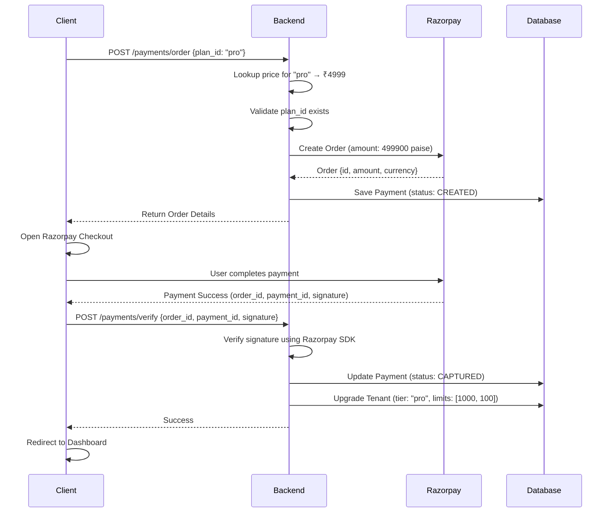

# Payment System Architecture

> **Last Updated**: 2026-02-03  
> **Status**: Production Ready

## Overview

Scira implements a secure, server-side pricing model for subscription management using Razorpay as the payment gateway. This document describes the complete payment flow, quota enforcement, and security measures.

---

## Architecture Principles

1. **Server-Side Pricing**: Prices are NEVER sent from the client. The server looks up prices from a central configuration.
2. **Quota Enforcement**: Plan limits are enforced at the API layer before resource creation.
3. **Idempotency**: Payment verification can be called multiple times safely.
4. **Audit Trail**: All payment transactions are logged in the database.

---

## Subscription Tiers

Defined in [`app/core/constants.py`](file:///f:/devlopment/miniproject/scira-backend/app/core/constants.py#L134-L170):

```python
class SubscriptionPlan(str, Enum):
    FREE = "free"
    PRO = "pro"
    ENTERPRISE = "enterprise"

PLAN_DETAILS = {
    SubscriptionPlan.FREE: {
        "name": "Free Tier",
        "price_inr": 0,
        "limits": {
            "max_students": 50,
            "max_exams_per_month": 5
        }
    },
    SubscriptionPlan.PRO: {
        "name": "Pro Tier",
        "price_inr": 4999,  # ₹4,999/month
        "limits": {
            "max_students": 1000,
            "max_exams_per_month": 100
        }
    },
    SubscriptionPlan.ENTERPRISE: {
        "name": "Enterprise",
        "price_inr": 0,  # Contact Sales
        "limits": {
            "max_students": 100000,
            "max_exams_per_month": 10000
        }
    }
}
```

---

## Payment Flow



---

## API Endpoints

### 1. Create Payment Order

**Endpoint**: `POST /api/v1/payments/order`  
**Auth**: Required (Tenant Admin)

**Request**:
```json
{
  "plan_id": "pro",
  "currency": "INR"
}
```

**Response**:
```json
{
  "id": "order_Abc123xyz456",
  "amount": 499900,
  "currency": "INR",
  "receipt": "rcpt_a1b2c3d4"
}
```

**Security**:
- ✅ Plan ID is validated against `PLAN_DETAILS`
- ✅ Price is looked up server-side (client cannot manipulate)
- ✅ Free/Enterprise plans reject order creation (price ≤ 0)

---

### 2. Verify Payment

**Endpoint**: `POST /api/v1/payments/verify`  
**Auth**: Required (Tenant Admin)

**Request**:
```json
{
  "razorpay_order_id": "order_Abc123xyz456",
  "razorpay_payment_id": "pay_Xyz789abc012",
  "razorpay_signature": "a1b2c3d4e5f6..."
}
```

**Response**:
```json
{
  "status": "success",
  "verified": true
}
```

**Security**:
- ✅ Signature verified using HMAC-SHA256
- ✅ Payment record must exist and belong to tenant
- ✅ Idempotent (already captured payments return success)
- ✅ Tenant upgrade only happens after signature verification

---

## Quota Enforcement

Defined in [`app/core/quota.py`](file:///f:/devlopment/miniproject/scira-backend/app/core/quota.py).

### Student Quota

**Enforced at**: `POST /api/v1/tenants/me/users` (when creating students)

```python
from app.core.quota import check_student_quota, QuotaExceededError

if user_data.role == UserRole.STUDENT:
    try:
        check_student_quota(db, tenant_id)
    except QuotaExceededError as e:
        raise HTTPException(
            status_code=402,  # Payment Required
            detail=f"Student quota exceeded: {e.current}/{e.limit}..."
        )
```

**Response** (when exceeded):
```json
{
  "detail": "Student quota exceeded: 50/50. Please upgrade your subscription."
}
```

---

### Exam Quota

**Enforced at**: `POST /api/v1/exams` (exam creation)

```python
from app.core.quota import require_quota

@router.post("/exams")
async def create_exam(
    ...,
    _quota_check = Depends(require_quota("exam"))
):
    ...
```

**How it works**:
1. Counts exams created in current month
2. Compares to `tenant.max_exams_per_month`
3. Returns `402 Payment Required` if exceeded

---

## Security Measures

### 1. Server-Side Pricing
```python
# ❌ BAD: Client sends amount
{"amount": 499900}  # Client could change this!

# ✅ GOOD: Client sends plan ID
{"plan_id": "pro"}  # Server looks up price
```

### 2. Signature Verification
```python
self.client.utility.verify_payment_signature({
    "razorpay_order_id": order_id,
    "razorpay_payment_id": payment_id,
    "razorpay_signature": signature
})
```

Uses Razorpay's official SDK to verify HMAC-SHA256 signature.

### 3. Tenant Isolation
```python
payment = db.query(Payment).filter(
    Payment.order_id == order_id,
    Payment.tenant_id == tenant_id  # ✅ Scoped to current tenant
).first()
```

### 4. Idempotency
```python
if payment.status == PaymentStatus.CAPTURED:
    # Already processed, check if upgrade completed
    if tenant.subscription_tier != plan_id:
        # Retry upgrade (handles partial failures)
        upgrade_tenant(tenant, plan_id)
    return True
```

---

## Database Models

### Payment

```python
class Payment(Base):
    id = Column(UUID, primary_key=True)
    tenant_id = Column(UUID, ForeignKey("tenants.id"))
    
    # Razorpay Fields
    order_id = Column(String(100), nullable=False)
    payment_id = Column(String(100), nullable=True)
    signature = Column(String(200), nullable=True)
    
    # Transaction Details
    amount = Column(Integer, nullable=False)  # in paise
    currency = Column(String(10), default="INR")
    status = Column(Enum(PaymentStatus))
    receipt = Column(String(100), nullable=True)
    notes = Column(JSONB)  # Stores plan_id
```

### Tenant (Quota Fields)

```python
class Tenant(Base):
    subscription_tier = Column(String(50), default="free")
    max_students = Column(Integer, nullable=True)
    max_exams_per_month = Column(Integer, nullable=True)
```

---

## Error Handling

### Frontend Display

All quota errors (402 status) are caught and displayed as toast notifications:

```typescript
// In api.ts interceptor
const errorMessage = errorData?.detail || "An error occurred";
return Promise.reject(new Error(errorMessage));

// In component
onError: (error) => {
    toast.error(error.message);  
    // Displays: "Student quota exceeded: 50/50. Please upgrade..."
}
```

---

## Testing Checklist

- [ ] Create order with invalid plan_id → 400 error
- [ ] Create order with free/enterprise plan → 400 error  
- [ ] Payment verification with wrong signature → 400 error
- [ ] Exceed student quota → 402 error
- [ ] Exceed exam quota → 402 error
- [ ] Successful payment → Tenant upgraded with correct limits
- [ ] Verify idempotency (call verify twice) → Success both times

---

## Configuration

### Environment Variables

```env
# Razorpay Credentials
RAZORPAY_KEY_ID=rzp_test_SBjVC68mLmwwL7
RAZORPAY_KEY_SECRET=WhN2n8b3Lw6DgxhmZknoQGbw

# Frontend
NEXT_PUBLIC_RAZORPAY_KEY_ID=rzp_test_SBjVC68mLmwwL7
```

⚠️ **Production**: Use `rzp_live_` keys from Razorpay Dashboard.

---

## Monitoring

### Key Metrics to Track

1. **Payment Success Rate**: `CAPTURED / CREATED`
2. **Quota Hit Rate**: Count of 402 errors
3. **Upgrade Conversions**: Free → Pro upgrades per month
4. **Failed Signatures**: Invalid signature attempts (security alert)

### Recommended Alerts

- Failed signature verification (potential fraud)
- Payment stuck in CREATED status > 1 hour
- Quota errors spike (users hitting limits)

---

## Future Enhancements

1. **Webhooks**: Handle async payment updates from Razorpay
2. **Recurring Billing**: Auto-debit every month (requires Razorpay Subscriptions)
3. **Proration**: Credit unused days when upgrading mid-cycle
4. **Invoicing**: Auto-generate invoices for enterprise customers
5. **Usage Analytics**: Detailed quota usage dashboard

---

## Related Documentation

- [Database Models](file:///f:/devlopment/miniproject/scira-backend/docs/DATABASE_MODELS.md)
- [System Design](file:///f:/devlopment/miniproject/scira-backend/docs/SYSTEM_DESIGN.md)
- [Quota Enforcement](file:///f:/devlopment/miniproject/scira-backend/docs/QUOTA_ENFORCEMENT.md) *(new)*
