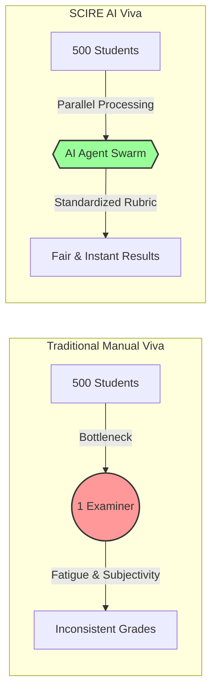
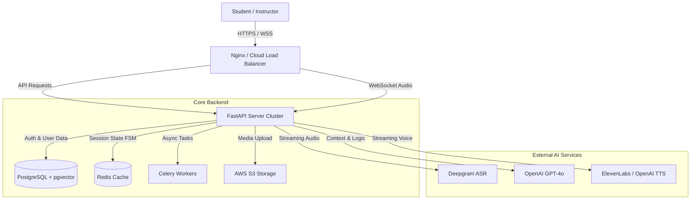

# PPT Content - AI Viva System

## Slide 0: PROJECT TITLE
**SCIRE - Intelligent AI-Proctored Viva System**
*(Dept_Id)*
Student Name(s): [Your Names]
S_UID(s): [Your IDs]

---

## Slide 1: THE PARADIGM SHIFT (INTRODUCTION)

### The Vision
> "Moving from static text-based testing to dynamic, voice-first verification."

**SCIRE** is an autonomous AI Examiner designed to solve the **Assessment Trilemma**:

| **Concept** | **The Implementation** |
| :--- | :--- |
| **🗣️ Conversational** | Replaces static forms with real-time, Socratic dialogue using **GPT-4o**. |
| **🛡️ Integrity-First** | Verified identity & environment monitoring eliminates the "ChatGPT Loophole". |
| **⚡ Infinite Scale** | Proctors 1 or 10,000 students simultaneously with zero fatigue. |

**The Bottom Line:** We don't just check *what* the student wrote; we verify *if they understand it*.

## Slide 2: SOFTWARE / HARDWARE REQUIREMENTS

**Hardware Requirements:**
*   **Client:** Laptop/PC with Webcam & Microphone (Functional).
*   **Server:** Multi-core CPU, 16GB+ RAM (for containerized deployment).
*   **Network:** Stable Broadband connection (>5 Mbps upload/download).

**Software Requirements:**
*   **Frontend:** Next.js 16 (App Router), React 19, Tailwind CSS v4.
*   **UI/State:** Shadcn UI, Framer Motion, GSAP (Animations), Zustand (FSM).
*   **Backend:** Python 3.11+, FastAPI (Async Monolithic SOA).
*   **Database:** PostgreSQL (pgvector for RAG), Redis (Session Caching).
*   **AI Services:** Deepgram (STT), OpenAI GPT-4o (Reasoning), ElevenLabs (TTS).
*   **Infrastructure:** Docker, Nginx, AWS S3 (Media Storage).

---

## Slide 3: PROBLEM STATEMENTS
*   **Scalability Bottleneck:** Human examiners cannot interview 500+ students individually in a day.
*   **Subjective Grading:** Grading varies drastically between different examiners (bias/fatigue).
*   **The "ChatGPT" Loophole:** Students can generate code/essays using AI, making written assignments unreliable for verification.
*   **Logistical Complexity:** Scheduling, venue management, and examiner availability create massive administrative overhead.

### Visualizing the Bottleneck

---

## Slide 4: PRELIMINARY DESIGN
*   **System Architecture (High Level):**

---

## Slide 5: PROJECT IMPLEMENTATION AND REAL-TIME EXAMPLE
*   **The "Exam Loop" (v2.0 Flow):**
    1.  **Secure Entry:** Student enters unique **8-char Exam Code**; checks attempt limits.
    2.  **Onboarding:** Mandatory T&C acceptance + **Identity Snapshot** (S3).
    3.  **Active Probing:** AI asks context-aware questions based on chunks retrieved from Vector DB.
    4.  **Dynamic Response:** System handles interruptions and silence using VAD (Voice Activity Detection).
*   **Real-Time Example:**
    *   *AI:* "Explain how `useEffect` differs from `useLayoutEffect`."
    *   *Student:* "Uh, `useEffect` runs after paint..."
    *   *AI (detecting pause):* "Go on, specifically regarding the timing."
    *   *Outcome:* Dynamic, follow-up based assessment, not just keyword matching.

---

## Slide 6: SECURITY FEATURES
*   **Authentication & Integrity:**
    *   **Exam Access Codes:** Unique tokens preventing unauthorized entry.
    *   **Identity Verification:** One-time **Onboarding Snapshot** compared against profile.
    *   **Secure Results:** Time-bound, tokenized result links sent via email (Expire in 30 days).
*   **Malpractice Prevention:**
    *   **Real-time Monitoring:** Tab-switch counters & Environment Noise scoring.
    *   **Session Locking:** Full-screen enforcement during the "Listen-Speak" loop.
    *   **Audit Trails:** Use of Immutable Logs for every grade change or override.

---

## Slide 7: FUTURE SCOPE
*   **Scalability:** Migrating monolithic services to Kubernetes (K8s) for handling 10,000+ concurrent vivas.
*   **Multimodal Evolution:** Integrating Whiteboard capabilities where students can draw diagrams while explaining.
*   **Institutional Adoption:** API integration with LMS platforms (Canvas, Moodle) for direct gradebook syncing.
*   **Emotional AI:** Analyzing student stress/confidence levels to adjust question difficulty dynamically.

---

## Slide 10: THANK YOU
*   **Conclusion:** Scire bridges the gap between scalable testing and authentic evaluation.
*   **Contact:** [Your Email/Contact Info]
*   **Q&A Session**
