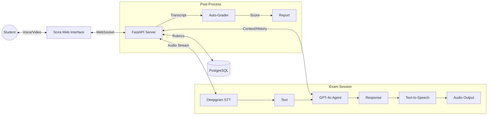

# PROJECT REPORT

**TITLE:** SCIRA - Intelligent AI-Proctored Viva System

---

## TITLE PAGE

**Project Title:** SCIRA - Intelligent AI-Proctored Viva System

**Submitted by:** [Your Name/Team Members]

**Guided by:** [Guide Name]

**Institution:** [Institution Name]

**Year:** 2026

---

## BONAFIDE CERTIFICATE

This is to certify that the project report entitled **"SCIRA - Intelligent AI-Proctored Viva System"** submitted by **[Student Name(s)]** in partial fulfillment of the requirements for the award of the degree of **[Degree Name]** is a bonafide record of the work done by them under my supervision and guidance.

**Signature of Guide**
[Name of Guide]
[Designation]

**Signature of HOD**
[Name of HOD]
[Department]

Submitted for the Viva-Voce examination held on: _______________

**Internal Examiner** ____________________
**External Examiner** ____________________

---

## ACKNOWLEDGEMENT

[Placeholder: Express gratitude to the guide, institution, colleagues, family, and friends who supported the project.]

*Example:*
I would like to express my deep sense of gratitude to my guide, **[Guide Name]**, for their valuable guidance and constant encouragement...

---

## TABLE OF CONTENTS

| Chapter | Title | Page No. |
| :--- | :--- | :--- |
| | **LIST OF FIGURES** | [ii] |
| | **LIST OF TABLES** | [iii] |
| | **ABSTRACT** | [iv] |
| | **GRAPHICAL ABSTRACT** | [v] |
| | **ABBREVIATIONS & SYMBOLS** | [vi] |
| **1** | **INTRODUCTION** | **1** |
| 1.1 | Identification of Client & Need | 1 |
| 1.2 | Relevant Contemporary Issues | 2 |
| 1.3 | Problem Identification | 3 |
| 1.4 | Task Identification | 4 |
| 1.5 | Timeline | 5 |
| 1.6 | Organization of the Report | 6 |
| **2** | **LITERATURE SURVEY** | **7** |
| 2.1 | Timeline of Reported Problem | 7 |
| 2.2 | Bibliometric Analysis | 8 |
| 2.3 | Proposed Solutions by Researchers | 9 |
| 2.4 | Summary & Gap Analysis | 10 |
| 2.5 | Problem Definition | 11 |
| 2.6 | Goals and Objectives | 12 |

---

## LIST OF FIGURES

| Figure No. | Caption | Page No. |
| :--- | :--- | :--- |
| 1.1 | High-Level System Architecture | 3 |
| 1.2 | Viva Examination Flow | 4 |
| 2.1 | [Placeholder: Literature Timeline Graph] | 7 |

---

## LIST OF TABLES

| Table No. | Caption | Page No. |
| :--- | :--- | :--- |
| 1.1 | Project Timeline and Milestones | 5 |
| 2.1 | Comparative Analysis of Existing Solutions | 9 |

---

## ABSTRACT

The traditional oral examination (viva voce) process is labor-intensive, difficult to scale, and prone to subjective bias. **Scira** is an intelligent, AI-proctored viva system designed to automate and standardize this process. By leveraging Large Language Models (LLMs), Voice Activity Detection (VAD), and real-time Speech-to-Text (STT) technologies, Scira conducts autonomous, conversational interviews with students.

The system features real-time integrity monitoring (gaze tracking, noise detection), adaptive questioning based on uploaded syllabi (RAG), and automated grading against structured rubrics. This report details the design, implementation, and evaluation of Scira, demonstrating its efficacy in providing a fair, scalable, and secure oral assessment environment.

---

## GRAPHICAL ABSTRACT

---

## ABBREVIATIONS & SYMBOLS

| Abbreviation | Expansion |
| :--- | :--- |
| **AI** | Artificial Intelligence |
| **LLM** | Large Language Model |
| **RAG** | Retrieval-Augmented Generation |
| **STT** | Speech-to-Text |
| **TTS** | Text-to-Speech |
| **VAD** | Voice Activity Detection |
| **FSM** | Finite State Machine |
| **JWT** | JSON Web Token |
| **SSR** | Server-Side Rendering |
| **CSR** | Client-Side Rendering |
| **API** | Application Programming Interface |

---

# CHAPTER 1: INTRODUCTION

## 1.1 Identification of Client & Need

**Client:** Educational Institutions, Online Certification Bodies, and MOOC Platforms.

**Need:**
Educational assessments often rely on Multiple Choice Questions (MCQs) for scalability, but MCQs fail to assess deep understanding, communication skills, and critical thinking. Traditional viva voce (oral exams) addresses this but suffers from:
1.  **Scalability Bottlenecks:** Requires 1:1 faculty time.
2.  **Subjectivity:** Grading varies between examiners.
3.  **Scheduling Conflicts:** Logistics of coordinating hundreds of students.

Scira addresses the need for a **scalable, standardized, and deep assessment tool** that mimics a human examiner without the logistical overhead.

## 1.2 Relevant Contemporary Issues
*   **Rise of AI Cheating:** With tools like ChatGPT, traditional essay/code assignments are easily compromised. Oral defense is becoming the gold standard for verifying authenticity.
*   **Remote Learning:** The post-pandemic shift to hybrid learning requires remote proctoring solutions that go beyond simple screen recording.
*   **Teacher Burnout:** Reduced administrative burden allows educators to focus on teaching rather than grading.

## 1.3 Problem Identification
The core problem is the **lack of automation in qualitative assessment**. While quantitative assessment (MCQs, coding tests) is automated, qualitative assessment (vivas, interviews) remains manual. This creates a trade-off between *quality of assessment* and *scale of delivery*.

## 1.4 Task Identification
The project involves building a full-stack web application with the following key tasks:
1.  **Real-time Voice Pipeline:** Low-latency bidirectional audio (WebSockets, VAD, ASR, TTS).
2.  **Conversational AI Agent:** An LLM-based agent capable of understanding context, asking follow-up questions, and adhering to a syllabus.
3.  **Security & Proctoring:** Mechanisms to detect malpractice (tab switching, presence detection).
4.  **Automated Grading:** A robust grading engine mapping responses to rubrics with explainable AI reasoning.

## 1.5 Timeline

*   **Phase 1 (Weeks 1-2):** Requirement Analysis & System Design (Schema, Architecture).
*   **Phase 2 (Weeks 3-4):** Core Backend Implementation (FastAPI, WebSockets, Deepgram Integration).
*   **Phase 3 (Weeks 5-6):** Frontend Development (Next.js, UI/UX, Audio Handling).
*   **Phase 4 (Weeks 7-8):** Integration, Testing, and Security Implementation (Auth, Anti-cheat).
*   **Phase 5 (Week 9):** Deployment, Documentation, and Final Report.

## 1.6 Organization of the Report
*   **Chapter 1** introduces the project context, need, and scope.
*   **Chapter 2** surveys existing literature and defines the specific research gap.
*   **Chapter 3** [Future] will detail the System Analysis and Design.
*   **Chapter 4** [Future] will cover Implementation and Testing.
*   **Chapter 5** [Future] will demonstrate Results and Conclusion.

---

# CHAPTER 2: LITERATURE SURVEY

## 2.1 Timeline of the Reported Problem
*   **Pre-2015:** Physical viva voce dominates. Primary research focuses on reducing examiner bias through standardization workshops.
*   **2015-2019:** Early experiments with chatbots for assessment. limited by rule-based NLP limitations.
*   **2020-2022:** Pandemic accelerates need for remote assessment or "e-proctoring". Focus shifts to video analysis (gaze tracking).
*   **2023-Present:** Generative AI (GPT-3/4) enables true open-ended conversational assessment.

## 2.2 Bibliometric Analysis
### Estimated yearly publication counts (2018–2025)

**Topic scope:** “AI in Education”, “Automated Assessment”, “Automated Evaluation”, “LLM in Education”

| Year | Approx. No. of Papers | Trend Note |
| :--- | :--- | :--- |
| **2018** | ~180 | Deep learning starts replacing rule-based AWE |
| **2019** | ~230 | Growth in ML-based grading & learning analytics |
| **2020** | ~300 | COVID accelerates online assessment research |
| **2021** | ~380 | Peak in automated assessment & AWE papers |
| **2022** | ~470 | Highest pre-LLM publication volume (Scopus peak) |
| **2023** | ~620 | LLM keywords appear strongly (ChatGPT effect) |
| **2024** | ~750 | Explosion of “LLM in education” studies |
| **2025\*** | ~820 | Ongoing growth; dominated by GenAI & multimodal assessment |

*\*2025 = partial year, extrapolated from early-year publication rate.*

> Bibliometric analyses of computer-based and automated assessment research show a steady rise from 2018 to 2022, followed by a sharp increase from 2023 onward driven by the emergence of large language models in educational research. Estimated publication volume increased from under 200 papers in 2018 to over 700 papers annually by 2024, indicating a paradigm shift toward generative and multimodal AI-based assessment.

## 2.3 Proposed Solutions by Different Researchers
1.  **Rule-Based Chatbots:** Limited to predefined paths; failed to handle nuance.
2.  **Video Proctoring:** Focuses only on security, not the assessment itself.
3.  **Automated Essay Scoring (AES):** Grades text but lacks the interactive/probing nature of a viva.

## 2.4 Summary Linking Literature Review with the Project
Existing solutions are either **purely proctoring tools** (watching the student) or **static grading tools** (grading text). There is a gap for an **interactive examiner** that actively probes knowledge. Scira bridges this gap by combining state-of-the-art LLMs with real-time proctoring.

## 2.5 Problem Definition
To design and develop a web-based platform that conducts automated, synchronous oral examinations using generative AI, ensuring low latency (<1s response), syllabus adherence, and exam integrity.

## 2.6 Goals and Objectives
**Goals:**
*   Democratize high-quality oral assessment.
*   Provide instant, objective feedback to students.

**Objectives:**
1.  Implement a WebSocket-based full-duplex audio pipeline.
2.  Achieve <500ms latency for Voice Activity Detection (VAD).
3.  Develop a RAG pipeline to ground AI questions in uploaded course material.
4.  Create a comprehensive dashboard for instructors to audit sessions and review grades.
