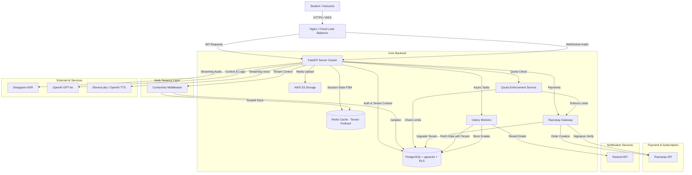
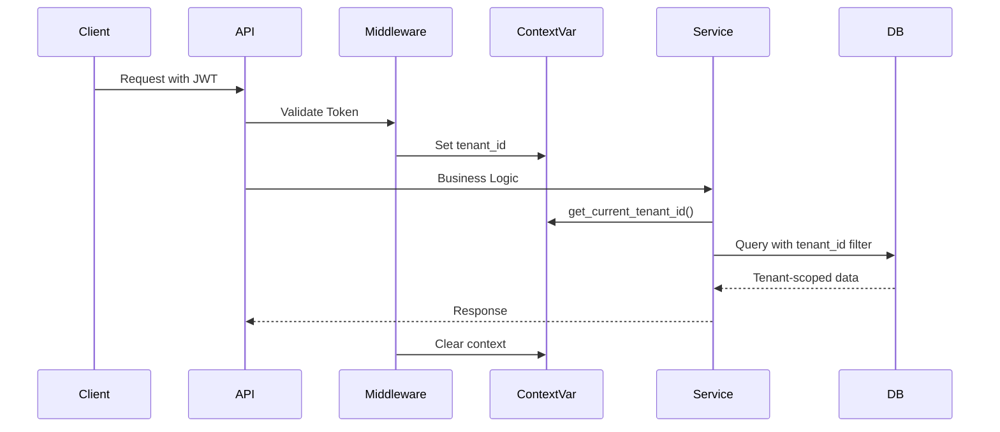
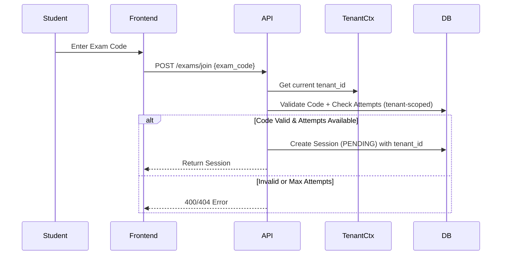
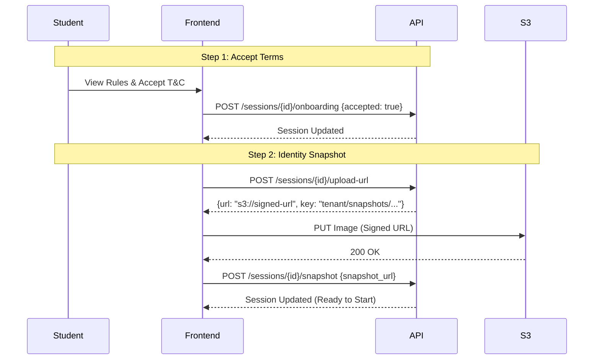
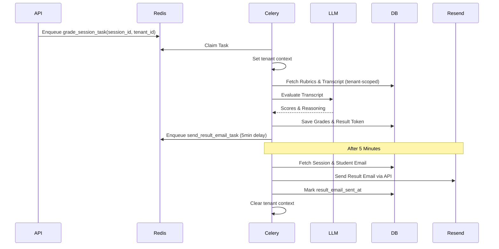
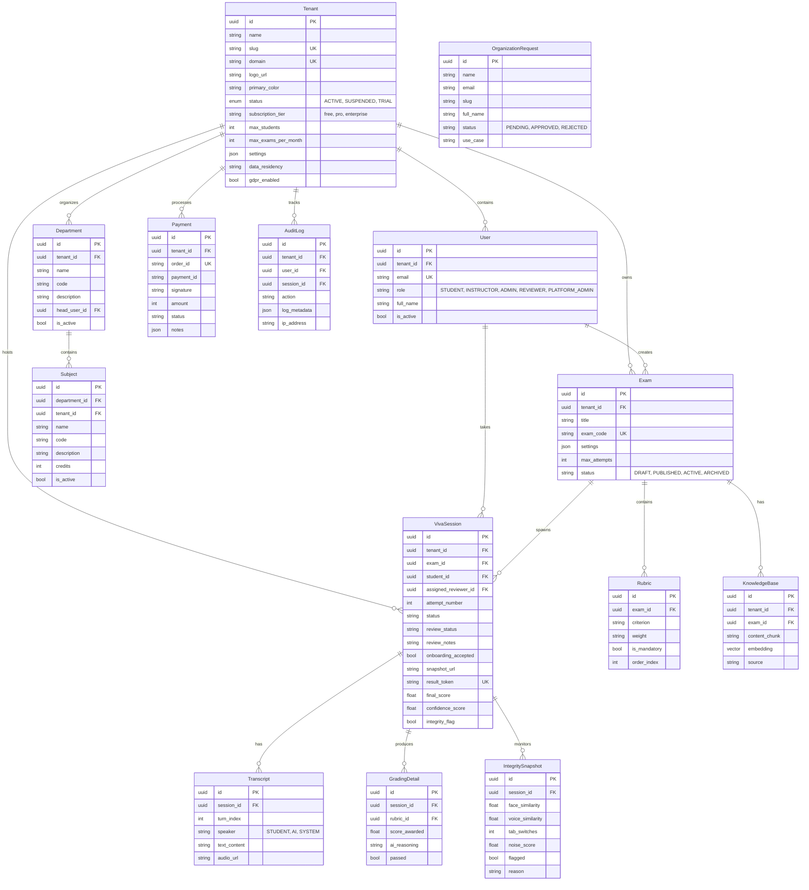
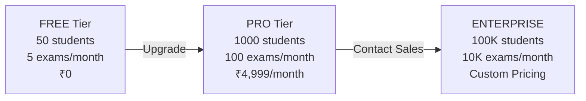

# Scire - System Design Document

**Version:** 3.1  
**Last Updated:** February 3, 2026  
**Author:** Mukul Anand

---

## 1. 🏗️ High-Level Architecture

Scire follows a **Multi-Tenant, Event-Driven, Service-Oriented Architecture** built on a monolithic FastAPI core. It leverages asynchronous processing for real-time interactions (Voice/AI) and background workers for heavy lifting (Grading, Notifications).

---

## 2. 🏢 Multi-Tenancy Architecture (NEW - v3.0)

### 2.1 Tenant Model
Each organization is represented by a `Tenant` entity:

| Field | Type | Description |
|-------|------|-------------|
| `id` | UUID | Primary key |
| `name` | String | Organization name |
| `slug` | String | URL-safe identifier |
| `domain` | String | Custom domain (optional) |
| `status` | Enum | ACTIVE, SUSPENDED, TRIAL |
| `subscription_tier` | String | FREE, PRO, ENTERPRISE |
| `max_students` | Integer | Student quota limit |
| `max_exams_per_month` | Integer | Monthly exam creation limit |
| `settings` | JSONB | Quotas, branding, features |

### 2.2 Tenant Isolation Strategy
- **Shared Database, Shared Schema**: All tenants share tables with `tenant_id` discriminator
- **Row-Level Security (RLS)**: Database-level enforcement
- **Tenant Context**: `ContextVar` for thread-safe isolation per request
- **JWT Claims**: Tokens include `tenant_id` and `tenant_slug`

### 2.3 Tenant Context Flow

---

## 3. 🔄 Core Data Workflows

### 3.1 Exam Join Flow
Students must use an **Exam Access Code** to join exams (scoped to tenant).

### 3.2 Pre-Exam Onboarding Flow
Before starting, students must complete mandatory onboarding.

### 3.3 The "Viva Loop" (Real-Time Voice Interaction)
This flow requires sub-500ms latency to feel natural.

1.  **Ingestion**: Client streams raw audio (binary) via WebSocket.
2.  **Transduction (ASR)**: Server forwards stream to **Deepgram**.
3.  **Logic (LLM)**:
    *   ASR Text + Conversation History + Exam Context -> sent to **LLM**.
    *   LLM generates response text.
4.  **Synthesis (TTS)**: Response text streamed to **ElevenLabs** or **OpenAI**.
5.  **Delivery**: TTS Audio + Text Transcript sent back to Client via WebSocket.
6.  **State Management**: `SessionStateService` updates FSM in Redis with **tenant-prefixed keys**.

### 3.4 The Grading & Notification Pipeline (Asynchronous)
Grading is decoupled from the live session with tenant context propagation.

---

## 4. 💾 Database Schema (ER Diagram)

The data model centers around the `Tenant`, `Exam` and `VivaSession` entities.

---

## 5. 🛡️ Security & Compliance Design

### 5.1 Role-Based Access Control (RBAC)
We enforce a strict hierarchy with tenant isolation:

| Role | Scope | Access |
|------|-------|--------|
| **PLATFORM_ADMIN** | Cross-tenant | All operations, user management, audit logs |
| **ADMIN** | Tenant-scoped | Tenant settings, departments, subjects |
| **INSTRUCTOR** | Tenant-scoped | Own exams (CRUD), session monitoring |
| **REVIEWER** | Tenant-scoped | Review grades, integrity data, flag sessions |
| **STUDENT** | Tenant-scoped | Own sessions, view results |

### 5.2 Tenant Isolation Enforcement
*   **JWT Validation**: Token's `tenant_id` must match user's `tenant_id`
*   **Tenant Status Check**: Suspended tenants are blocked
*   **Query Filtering**: All queries include `tenant_id` filter
*   **Background Tasks**: Tenant context passed and set in workers

### 5.3 Anti-Cheat Measures
*   **Integrity Snapshots**: Client sends regular heartbeats containing:
    *   `tab_switches`: Count of focus loss events.
    *   `noise_level`: Environmental audio checks.
*   **Replay Protection**: Timestamps on snapshots must be strictly increasing.
*   **Immutability**: Once an Exam is `PUBLISHED`, it becomes Read-Only.
*   **Identity Verification**: One-time photo snapshot at exam start.

### 5.4 Audit Trail
A dedicated `audit_logs` table records every sensitive action with:
*   **tenant_id**: Tenant isolation for logs
*   **actor_id**: Who did it
*   **action**: What they did
*   **metadata**: Before/After diffs
*   **ip_address**: Where they came from

---

## 6. 🚀 Scalability Strategy

*   **Stateless API**: The FastAPI servers hold no exam state. All state is in **Redis** with tenant-prefixed keys. This allows horizontal scaling of API nodes behind a Load Balancer.
*   **Async Grading & Notifications**: Heavy grading jobs and email sending are offloaded to queues with tenant context. If load spikes, we simply add more Celery Workers.
*   **Vector Search (Implemented)**: Postgres `pgvector` stores syllabus embeddings with `tenant_id` filtering. Queries use Cosine Similarity for RAG.
*   **Object Storage**: All media stored in S3 with tenant-prefixed keys for isolation.

---

## 7. 📚 RAG Knowledge Engine

*   **Vector Storage**: Uses `pgvector` on PostgreSQL with tenant-scoped embeddings.
*   **Hybrid AI Stack**:
    *   **Chat**: OpenAI GPT-4o for high-quality conversational logic.
    *   **Embeddings**: OpenAI (text-embedding-ada-002) for high-quality retrieval.
*   **Workflow**:
    1.  Instructor uploads Syllabus (`POST /exams/{id}/syllabus`).
    2.  Text is chunked and embedded with `tenant_id`.
    3.  Viva questions are generated using tenant-scoped context retrieval.

---

## 8. 🔑 New Features Summary (v3.0)

| Feature | Description |
|---------|-------------|
| **Multi-Tenancy** | Full tenant isolation with shared schema and RLS |
| **PLATFORM_ADMIN** | Cross-tenant system administration role |
| **Tenant Management** | User management, quotas, settings per tenant |
| **Reviewer Queue** | Dedicated `/sessions/reviewer/queue` endpoint |
| **Grade Finalization** | Lock grades after APPROVED/REJECTED status |
| **Resend Integration** | Modern email API (replaces SMTP) |
| **Tenant Context** | Thread-safe isolation via ContextVar |
| **Quota Enforcement** | Student and exam quotas enforced at API layer |
| **Payment System** | Razorpay integration with server-side pricing |
| **Subscription Tiers** | FREE, PRO, ENTERPRISE with automatic quota upgrades |

---

## 9. 💳 Payment & Subscription System (NEW - v3.0)

### 9.1 Subscription Tiers

### 9.2 Payment Flow

1. **Order Creation**: Client sends `plan_id: "pro"`, server looks up price (₹4,999)
2. **Razorpay Checkout**: User completes payment in Razorpay modal
3. **Signature Verification**: Server verifies payment using HMAC-SHA256
4. **Tenant Upgrade**: Subscription tier and quotas updated automatically

### 9.3 Quota Enforcement

**Student Quota**: Checked before creating new students via `POST /tenants/me/users`
**Exam Quota**: Checked before creating exams via `POST /exams`

When exceeded, returns `402 Payment Required` with upgrade prompt.

**See detailed documentation**:
- [Payment System](file:///f:/devlopment/miniproject/scira-backend/docs/PAYMENT_SYSTEM.md)
- [Quota Enforcement](file:///f:/devlopment/miniproject/scira-backend/docs/QUOTA_ENFORCEMENT.md)
